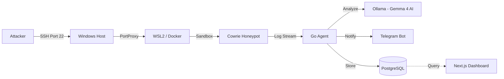
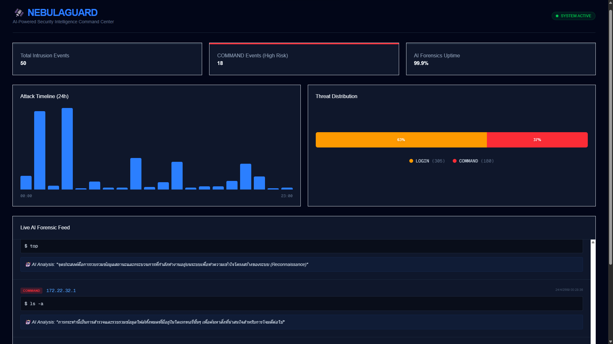
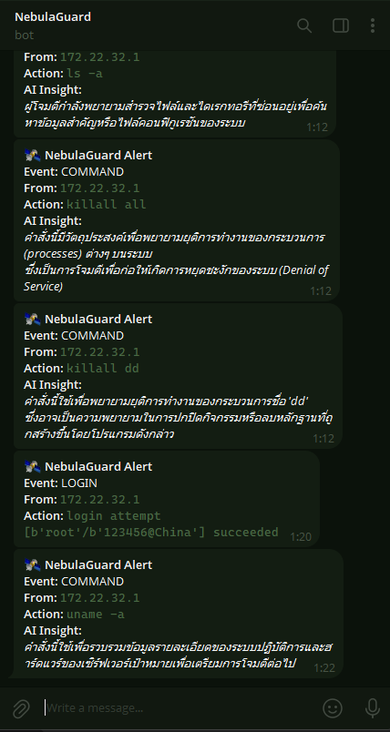
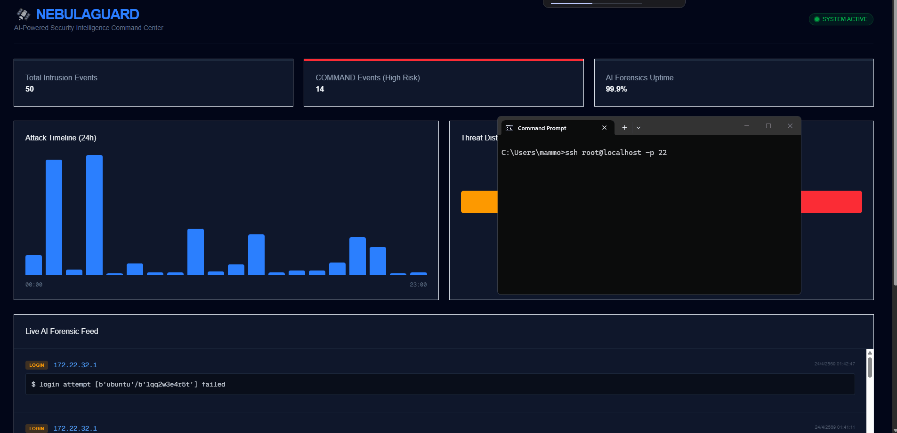

-----

# 🛰️ NebulaGuard: Next-Gen AI-Powered Honeypot & Forensic Intelligence

**NebulaGuard** คือระบบความปลอดภัยเชิงรุก (Proactive Security) ที่รวมขุมพลังของ **SSH Honeypot**, **High-performance Go Agent** และ **Gemma 4 AI** เข้าด้วยกัน เพื่อดักจับ วิเคราะห์ และตอบโต้การบุกรุกแบบ Real-time โดยเปลี่ยน Log ดิบให้เป็นบทวิเคราะห์ภาษาไทยที่แม่นยำผ่านการประมวลผลบน GPU

-----

## ✨ Key Features

  * **Gemma 4 AI Intelligence:** ใช้โมเดล AI รุ่นล่าสุดที่ปรับแต่งเพื่อความเข้าใจภาษาไทยระดับสูง สรุปเจตนาและวิเคราะห์ TTPs (Tactics, Techniques, and Procedures) ของผู้บุกรุกได้อย่างแม่นยำ
  * **GPU-Accelerated Analytics:** ประมวลผล AI ผ่าน **NVIDIA RTX 3060** โดยใช้ NVIDIA Container Toolkit เพื่อการวิเคราะห์ผลแบบ Low-latency
  * **Real-time Command Center:** Dashboard สไตล์ SOC พัฒนาด้วย **Next.js 15** แสดงผลสถิติการโจมตี (Attack Timeline & Threat Distribution) แบบสดๆ ผ่าน Native Tailwind Visualization
  * **Zero-Loss Data Pipeline:** พัฒนาด้วย **Go (Golang)** เพื่อดึงข้อมูลผ่าน IO Pipes จาก Container โดยตรง มั่นใจได้ว่าทุกคำสั่งของผู้บุกรุกจะถูกบันทึกลง **PostgreSQL** ครบถ้วน
  * **Instant Threat Notification:** แจ้งเตือนเหตุการณ์สำคัญเข้า **Telegram Bot** ทันที พร้อมแนบบทวิเคราะห์จาก AI เพื่อการตัดสินใจที่รวดเร็ว

-----

## 🏗️ System Architecture



-----

## 🖥️ Preview & Monitoring

### Command Center

*Real-time visualization of attack patterns and AI-generated forensic insights.*

### 📱 Instant Telegram Alerts


*AI-Powered forensic reports sent directly to your mobile device upon critical incidents.*

### 🛰️ Live Demonstration
 
*A real-time demo showing the SSH attack, AI analysis, and instant notification flow.*

-----

## 🛠️ Tech Stack

  * **Frontend:** Next.js 15 (App Router), Tailwind CSS v4, Tremor UI
  * **Backend:** Golang 1.23
  * **AI Model:** Gemma 4 (via Ollama)
  * **Database:** PostgreSQL 15
  * **Honeypot:** Cowrie
  * **Infrastructure:** Docker, WSL2, NVIDIA Container Toolkit

-----

## 🚀 Quick Start

### 1\. Prerequisites

  * Windows 11 with WSL2
  * NVIDIA GPU + Container Toolkit
  * Docker Desktop / Standalone

### 2\. Environment Configuration

สร้างไฟล์ `.env` ใน Root Directory:

```env
# Database Configuration
DB_USER=user
DB_PASSWORD=password
DB_NAME=nebulaguard

# AI Configuration
AI_MODEL=gemma4:e2b

# Notification
TELEGRAM_TOKEN=your-bot-token
TELEGRAM_CHAT_ID=your-telegram-id
```

### 3\. Deployment

```bash
# Clone the repository
git clone https://github.com/useless007/nebula-guard.git
cd nebula-guard

# Start all services
docker compose up -d --build
```

### 4\. Port Forwarding (PowerShell Admin)

```powershell
netsh interface portproxy add v4tov4 listenport=22 listenaddress=0.0.0.0 connectport=2222 connectaddress=<WSL_IP>
```

-----

## 🛡️ Security & Isolation

NebulaGuard ออกแบบมาเพื่อความปลอดภัยสูงสุด:

  * **Isolation:** ผู้บุกรุกจะถูกขังอยู่ใน Docker Container ที่ไม่มีสิทธิ์เข้าถึงเครื่อง Host
  * **UFW Filtering:** ตั้งกฎ Firewall ขาออกเพื่อป้องกันไม่ให้เครื่องที่ถูกบุกรุกโจมตีเครือข่ายภายใน (Lateral Movement)
  * **Local AI:** การวิเคราะห์ข้อมูลทั้งหมดเกิดขึ้นภายในเครื่อง (Local) ไม่มีการส่งข้อมูลความปลอดภัยออกไปยัง Cloud ภายนอก

-----

*Developed with 💻, 🛰️ & 🤖 by Useless007*

-----
